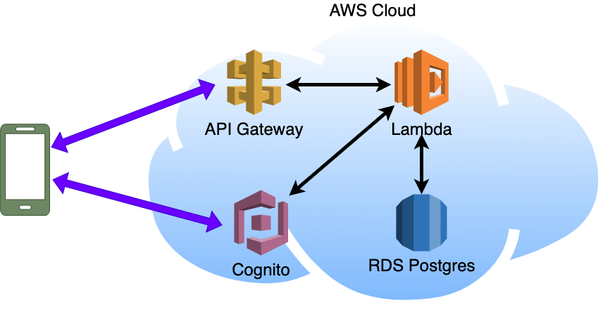

## Golf Cart rental service implementation

This is the implementation of the com.golfcartrental server-side components. The server-side implementation uses AWS' api-gateway, lambda and RDS (Postgres) to provide APIs.

A mobile app developed in Flutter for iOS that uses these APIs are available at https://github.com/nikkisuneel/golf-cart-cartRental-ui.

### Architecture

### Deployment

The following deployment steps are needed
- Login to AWS management console. Perform the following steps using the console.
- Create a new API in AWS API gateway. See https://docs.aws.amazon.com/apigateway/latest/developerguide/welcome.html
- Use the openapi.yaml to create the resources and their corresponding methods by importing it into the AWS API Gateway
- Configure each of the resource methods to use their corresponding Lambda functions. See https://docs.aws.amazon.com/apigateway/latest/developerguide/set-up-lambda-integrations.html
  * For /cartRentals API methods, integrate with CartRental Lambda function
  * For /carts API methods, integrate with CartInfo Lambda function
  * For /members API methods, integrate with MemberInfo Lambda function  
- Navigate to the Lambda console and create the following functions. For all the functions, upload the GolfCartBookingService.jar for the function code.
    * CartRental
      * Use com.golfcartrental.lambda.CartRentalAPIRequestHandler::handleRequest as the Handler Runtime Setting
    * CartInfo
      * Use com.golfcartrental.lambda.CartAPIRequestHandler::handleRequest as the Handler Runtime Setting
    * MemberInfo
      * Use com.golfcartrental.lambda.MemberAPIRequestHandler::handleRequest as the Handler Runtime Setting
- Navigate to Database -> RDS and create a Postgres database using instructions at https://aws.amazon.com/getting-started/tutorials/create-connect-postgresql-db/
  Use the following scripts under the src/main/sql directory to build the database.
    * Create Database: create_database.sql
    * Create Schema: create_schema.sql
    * Create tables: create_table_cart_type.sql
        * create_table_cart_rental.sql
        * create_table_member.sql
- Download pgAdmin from https://www.pgadmin.org/download/
- Using pgAdmin, run the src/main/sql/create_table_cart_rental.sql, src/main/sql/create_table_cart_type.sql and src/main/sql/create_table_member.sql scripts to create the cartRental, cart_type and member tables
